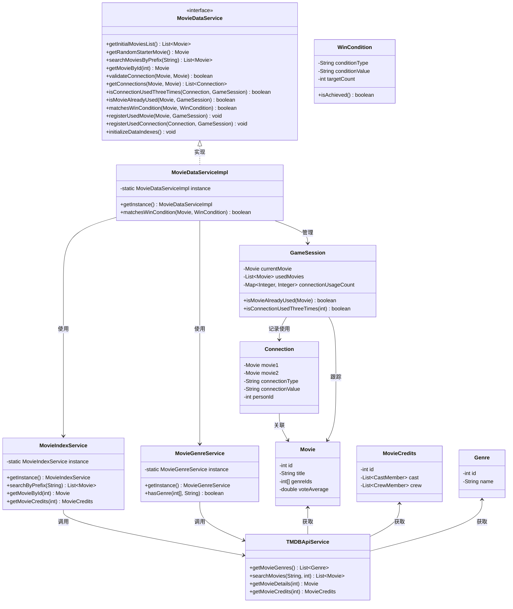

# 电影对战游戏系统架构文档

> gaoyukun-data-v1

## 1. MovieDataService的作用和方法

`MovieDataService`是系统的核心接口，负责提供游戏所需的所有电影数据相关功能。具体功能包括：

### 电影数据获取
- `getInitialMoviesList()`: 获取初始电影列表（Top 5000热门电影）
- `getRandomStarterMovie()`: 获取随机起始电影，作为游戏开始点
- `searchMoviesByPrefix(String prefix)`: 根据前缀搜索电影，支持玩家输入
- `getMovieById(int movieId)`: 根据ID获取电影详情

### 电影连接验证
- `validateConnection(Movie previousMovie, Movie currentMovie)`: 验证两部电影之间是否存在有效连接
- `getConnections(Movie previousMovie, Movie currentMovie)`: 获取两部电影之间的所有连接（共同演员、导演、编剧）

### 游戏规则管理
- `isConnectionUsedThreeTimes(Connection connection, GameSession session)`: 检查连接是否已被使用三次
- `isMovieAlreadyUsed(Movie movie, GameSession session)`: 检查电影是否已在游戏中使用
- `matchesWinCondition(Movie movie, WinCondition condition)`: 检查电影是否满足胜利条件（类型、演员、导演、编剧）

### 游戏状态更新
- `registerUsedMovie(Movie movie, GameSession session)`: 注册已使用的电影
- `registerUsedConnection(Connection connection, GameSession session)`: 注册已使用的连接

### 系统初始化
- `initializeDataIndexes()`: 初始化数据索引，为快速查询做准备

## 2. 各个类的关系及调用方式

### 核心服务类及其关系

1. **MovieDataServiceImpl**
   - 实现`MovieDataService`接口，是系统的主要业务逻辑实现
   - 使用单例模式，通过`getInstance()`方法获取实例
   - 依赖`MovieIndexService`进行电影数据检索和缓存
   - 依赖`MovieGenreService`进行电影类型匹配
   - 调用`TMDBMovieCacheService`获取初始电影列表

   ```java
   // 获取服务实例
   MovieDataService movieService = MovieDataServiceImpl.getInstance();
   
   // 搜索电影
   List<Movie> results = movieService.searchMoviesByPrefix("星际");
   
   // 检查电影连接
   boolean isValid = movieService.validateConnection(movie1, movie2);
   ```

2. **MovieIndexService**
   - 负责构建和维护电影的多种索引，提供快速查询功能
   - 管理电影标题前缀索引、ID索引、演员索引和导演索引
   - 缓存电影详情和演职人员信息，减少API调用
   - 调用`TMDBApiService`获取未缓存的电影数据

   ```java
   // 通过MovieDataService间接使用
   Movie movie = movieService.getMovieById(123);
   
   // 也可直接使用（不推荐）
   MovieIndexService indexService = MovieIndexService.getInstance();
   List<Movie> actorMovies = indexService.getMoviesByActor(actorId);
   ```

3. **MovieGenreService**
   - 负责管理电影类型的映射关系
   - 提供类型ID到名称、名称到ID的双向映射
   - 调用`TMDBApiService`获取电影类型列表
   - 提供`hasGenre`方法判断电影是否属于指定类型

   ```java
   // 通过MovieDataService间接使用（在matchesWinCondition方法中）
   boolean matches = movieService.matchesWinCondition(movie, genreCondition);
   
   // 也可直接使用（不推荐）
   MovieGenreService genreService = MovieGenreService.getInstance();
   boolean hasAction = genreService.hasGenre(movie.getGenreIds(), "动作");
   ```

4. **TMDBApiService**
   - 封装TMDB API的原始请求
   - 提供电影搜索、获取电影详情、获取演职人员和获取类型列表等方法
   - 被其他服务类调用，很少直接使用

5. **TMDBMovieCacheService**
   - 缓存TMDB API返回的热门电影列表
   - 提供获取指定数量热门电影的方法
   - 减少重复API调用，提高性能

### 模型类及其使用

1. **Movie**
   - 表示TMDB电影实体，包含ID、标题、类型ID等信息
   - 是系统的核心数据模型，被各个服务广泛使用

2. **MovieCredits**
   - 表示电影的演职人员信息，包含演员和剧组成员列表
   - 用于验证电影连接和胜利条件

3. **Genre**
   - 表示TMDB电影类型，包含ID和名称
   - 用于电影类型匹配和胜利条件验证

4. **Connection**
   - 表示两部电影之间的共通关系（演员、导演等）
   - 用于游戏中记录和验证电影连接

5. **GameSession**
   - 表示一局游戏会话
   - 管理已使用的电影和连接，以及当前游戏状态

6. **WinCondition**
   - 表示游戏胜利条件
   - 包含条件类型、值和目标次数

## 3. 系统架构UML图


